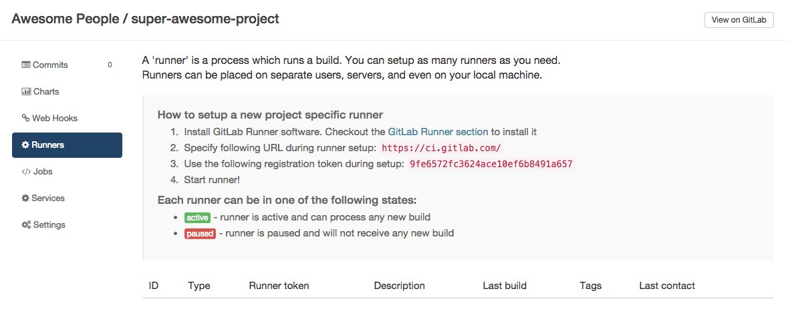
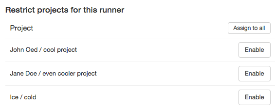

# Runners

In GitLab CI, Runners run your [yaml](../yaml/README.md).
A Runner is an isolated (virtual) machine that picks up jobs
through the coordinator API of GitLab CI.

A Runner can be specific to a certain project or serve any project
in GitLab CI. A Runner that serves all projects is called a shared Runner.

Ideally, GitLab Runner should not be installed on the same machine as GitLab.
Read the [requirements documentation](../../install/requirements.md#gitlab-Runner)
for more information.

## Shared vs. Specific Runners

A Runner that is specific only runs for the specified project. A shared Runner
can run jobs for every project that has enabled the option
`Allow shared Runners`.

**Shared Runners** are useful for jobs that have similar requirements,
between multiple projects. Rather than having multiple Runners idling for
many projects, you can have a single or a small number of Runners that handle
multiple projects. This makes it easier to maintain and update Runners.

**Specific Runners** are useful for jobs that have special requirements or for
projects with a specific demand. If a job has certain requirements, you can set
up the specific Runner with this in mind, while not having to do this for all
Runners. For example, if you want to deploy a certain project, you can setup
a specific Runner to have the right credentials for this.

Projects with high demand of CI activity can also benefit from using specific Runners.
By having dedicated Runners you are guaranteed that the Runner is not being held
up by another project's jobs.

You can set up a specific Runner to be used by multiple projects. The difference
with a shared Runner is that you have to enable each project explicitly for
the Runner to be able to run its jobs.

Specific Runners do not get shared with forked projects automatically.
A fork does copy the CI settings (jobs, allow shared, etc) of the cloned repository.

# Creating and Registering a Runner

There are several ways to create a Runner. Only after creation, upon
registration its status as Shared or Specific is determined.

[See the documentation for](https://gitlab.com/gitlab-org/gitlab-ci-multi-Runner/#installation)
the different methods of installing a Runner instance.

After installing the Runner, you can either register it as `Shared` or as `Specific`.
You can only register a Shared Runner if you have admin access to the GitLab instance.

## Registering a Shared Runner

You can only register a shared Runner if you are an admin on the linked
GitLab instance.

Grab the shared-Runner token on the `admin/Runners` page of your GitLab CI
instance.


Now simply register the Runner as any Runner:

```
sudo gitlab-ci-multi-Runner register
```

Shared Runners are enabled by default as of GitLab 8.2, but can be disabled with the
`DISABLE SHARED RunnerS` button. Previous versions of GitLab defaulted shared Runners to
disabled.

## Registering a Specific Runner

Registering a specific can be done in two ways:

1. Creating a Runner with the project registration token
1. Converting a shared Runner into a specific Runner (one-way, admin only)

There are several ways to create a Runner instance. The steps below only
concern registering the Runner on GitLab CI.

###  Registering a Specific Runner with a Project Registration token

To create a specific Runner without having admin rights to the GitLab instance,
visit the project you want to make the Runner work for in GitLab CI.

Click on the Runner tab and use the registration token you find there to
setup a specific Runner for this project.



To register the Runner, run the command below and follow instructions:

```
sudo gitlab-ci-multi-Runner register
```

###  Lock a specific Runner from being enabled for other projects

You can configure a Runner to assign it exclusively to a project. When a
Runner is locked this way, it can no longer be enabled for other projects.
This setting is available on each Runner in *Project Settings* > *Runners*.

###  Making an existing Shared Runner Specific

If you are an admin on your GitLab instance,
you can make any shared Runner a specific Runner, _but you can not
make a specific Runner a shared Runner_.

To make a shared Runner specific, go to the Runner page (`/admin/Runners`)
and find your Runner. Add any projects on the left to make this Runner
run exclusively for these projects, therefore making it a specific Runner.



## Using Shared Runners Effectively

If you are planning to use shared Runners, there are several things you
should keep in mind.

### Use Tags

You must setup a Runner to be able to run all the different types of jobs
that it may encounter on the projects it's shared over. This would be
problematic for large amounts of projects, if it wasn't for tags.

By tagging a Runner for the types of jobs it can handle, you can make sure
shared Runners will only run the jobs they are equipped to run.

For instance, at GitLab we have Runners tagged with "rails" if they contain
the appropriate dependencies to run Rails test suites.

### Prevent Runner with tags from picking jobs without tags

You can configure a Runner to prevent it from picking jobs with tags when
the Runner does not have tags assigned. This setting is available on each
Runner in *Project Settings* > *Runners*.

### Be careful with sensitive information

If you can run a job on a Runner, you can get access to any code it runs
and get the token of the Runner. With shared Runners, this means that anyone
that runs jobs on the Runner, can access anyone else's code that runs on the Runner.

In addition, because you can get access to the Runner token, it is possible
to create a clone of a Runner and submit false jobs, for example.

The above is easily avoided by restricting the usage of shared Runners
on large public GitLab instances and controlling access to your GitLab instance.

### Forks

Whenever a project is forked, it copies the settings of the jobs that relate
to it. This means that if you have shared Runners setup for a project and
someone forks that project, the shared Runners will also serve jobs of this
project.

## Attack vectors in Runners

Mentioned briefly earlier, but the following things of Runners can be exploited.
We're always looking for contributions that can mitigate these
[Security Considerations](https://docs.gitlab.com/runner/security/).
